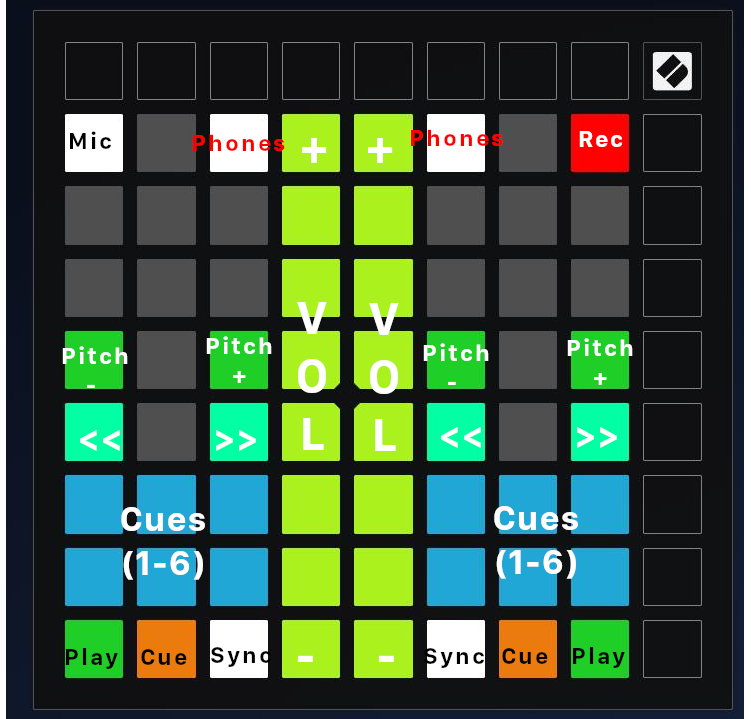

# Custom modes and DAW (Traktor/Mixxx/Bitwig) mappings for the Novation Launchpad MK2 / X / Mini.

## DJ Mode
A custom-made set of mappings and custom modes for use as a DJ controller in Traktor & Mixxx. Designed to be simple to use yet feature-packed.
"DJ Main" controls play/cue/pause, cue points, fast forward/rewind, pitch up/down & track volume, and "DJ EQ" controls Hi-Mid-Low ends + Super FX knobs.

### Installation:
Copy the Mixxx files to your Mixxx installation's controller folder (found in /home/<username>/.mixxx/controllers on Linux, /Users/<username>/Library/Containers/org.mixxx.mixxx/Data/Library/Application Support/Mixxx/controllers on macOS and C:\Users\<username>\AppData\local\Mixxx\controllers in Windows.), or if you're using Traktor, import the .tsi file via "Preferences -> Controller Manager -> Device -> Import .TSI -> Import Other".

### Known Issues:
When setting a slider back to it's default state, you'll need to tap on the last pressed pad 4 times to get it exactly in the middle. To my knowledge there isn't a workaround for this as this is expected behaviour from the faders, so keep it in mind when adjusting the EQ/FX on a track. This can be worked around by removing the FX sliders in Novation's Custom Mode editor and adding MIDI buttons to reset the EQ/FX sliders to their default state. 

### TODO:
- Sync LEDs to BPM + cue states, hopefully sync volume fader LEDs to volume meter but I'm unsure as to if that's both possible and within my ability or not.
- Optimize, optimize, optimize!
- Finish the Traktor mapping
- Map >> and << to much finer speeds to "emulate" jogwheels.

### Why?
Simply because I can. The Launchpad series is a fantastic piece of kit that I regularly use with Bitwig, and with it being MIDI-compliant & having fader pads and 8 custom modes makes it a fantastic candidate as a compact DJ controller if you don't need jogwheels. This script gives the Launchpad more DJ functionality than my Hercules DJControl Compact had when I owned it, which in my eyes makes it a versatile piece of DJ hardware.

I'm always looking for constructive feedback on making this setup ergonomically friendly and simple to use while still being feature-equivalent to compact DJ controllers, so don't hesitate to suggest modifications!
